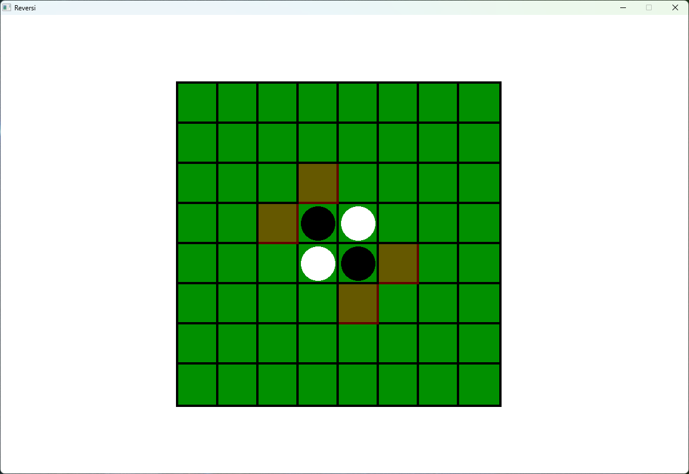

# Reversi



Reversi game implementation with Alpha-Beta search based AI.

## How to play

After run the app you will see terminal window with AI selection. Select options by typing numbers. You can play with AI, other Human or set a match between different AIs.

## Instalation - Linux

1. Download SFML files;

```bash
sudo apt-get install libsfml-dev
```

or

```bash
sudo pacman -S sfml
```

2. Clone repository

```bash
git clone https://github.com/WiktorOgrodnik/Reversi.git
```

3. Compile using make

```bash
make game
```

5. Run

```bash
./reversi
```

## Instalation - Windows

1. Download and install [MSYS2](https://www.msys2.org/)
2. Via pacman downlad SFML, mingw64, make

```bash
pacman -S mingw-w64-x86_64-sfml
pacman -S make
pcamna -S git
```

3. Clone repository

```bash
git clone https://github.com/WiktorOgrodnik/Reversi.git
```

4. Compile using make

```bash
make game
```

6. Run  

```bash
./reversi.exe
```

## License

[MIT](./LICENSE)
